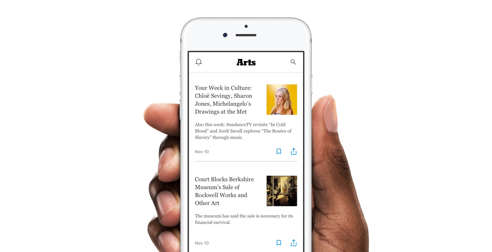

# Framer Workshops
Resources and prototypes I tend to go through when giving workshops.

## Outcomes
By the end of the workshop your students should hopefully have some understanding of the below. They shouldn't be expected to re-create what they've learnt immediately—confidence, familiarity, and being able to 'think' programmatically is great.

### Design
- Creating and editing layers
  - Alignment and resizing (anchoring and pinning)
  - Parents and children
  - Fill
  - Typography
- Making layers active in Code (targets)

### Code
- Writing comments
  - Stating your intentions (through plain language)
- Snippets
- Adding states
  - Changing layer properties through states
  - Editing state animation
- Creating events
  - Controlling states in events
- Creating layers in code
- Importing layers from Sketch
  - Referencing Sketch layers
- FlowComponent
  - Event history
  - Modals
  - Scrolling
    - Smart headers and footers
- Layer ordering (stacking)

### Misc
- Previewing on mobile
- Sharing to framer.cloud

## Starting off
Get a feel for the room's familiarity with [Framer][framer], [Sketch][sketch], and coding/digital design in general. Adapt the pace and depth of the sessions accordingly.

## Prerequisites
### Framer
For Mac only. Minimum system requirements unknown, though I've run it on pretty low-end college computers okay.

#### Framer Library
If a student doesn't have a Mac, has a lapsed trial, or any other problem, they can download the free [Framer Library][library].

### Framer for iOS or Android
If you'd like students to demo _Preview on mobile_. Sometimes impossible on college username/password wifi setups. [iOS][ios] and [Android][android].

## The prototype
`arts.framer`: A replica of the NYTimes Arts section as a stand-alone native app. I show this at the start (and occasionally throughout) to give context of what's going to be built. We always start with a blank prototype.

### Sources
Articles that I've referenced for use in `arts.framer`:
- [Your Week in Culture: Chloë Sevigny, Sharon Jones, Michelangelo’s Drawings at the Met](https://www.nytimes.com/2017/11/10/arts/your-week-in-culture-chloe-sevigny-sharon-jones-michelangelos-drawings-at-the-met.html)
- [From Greenwich Village to the Nation, Leading the Push for Women’s Rights](https://www.nytimes.com/2017/11/09/arts/hotbed-exhibition-new-york-historical-society.html)
- [Court Blocks Berkshire Museum’s Sale of Rockwell Works and Other Art](https://www.nytimes.com/2017/11/10/arts/rockwell-berkshire-museum-sale.html)

## Leaving-off
How to keep progressing after this workshop:

- Join the [Framer][framer] group and ask questions
- Join the [Framer NYC group][framer-nyc-group] and keep an eye out for meetups
- Re-create your favourite interactions and prototypes
- Go through other [video][video-tutorials] and [text][text-tutorials] tutorials

## What I don't cover
- Loops
- Modules
- APIs

[framer]:https://framer.com
[sketch]:http://sketchapp.com
[library]:https://github.com/koenbok/Framer#set-up-framer-library
[ios]:https://itunes.apple.com/us/app/framer-preview/id1124920547?mt=8
[android]:https://play.google.com/store/apps/details?id=com.framerjs.android&hl=en
[framer-group]:https://www.facebook.com/groups/framerjs/
[framer-nyc-group]:https://www.facebook.com/groups/framernyc/
[video-tutorials]:https://framer.com/getstarted/tutorials/
[text-tutorials]:https://blog.framer.com/create-an-ios-news-app-in-4-simple-steps-2b3fc3bb5780?
